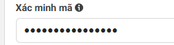

Cách chạy hệ thống
* Tạo file .env chứa các nội dung sau:
- GOOGLE_API_KEY = 

PAGE_ACCESS_TOKEN = " Thêm token vào đây"

VERIFY_TOKEN = " mã dưới đây" 

1. tạo venv 
2. install setup.txt #file thư viện
3. chạy theo môi trường ảo 
4. Lệnh chạy app.py: python app.py
5. chạy song song:  .\ngrok http 8000

chạy 4 và 5 ở 2 terminal 